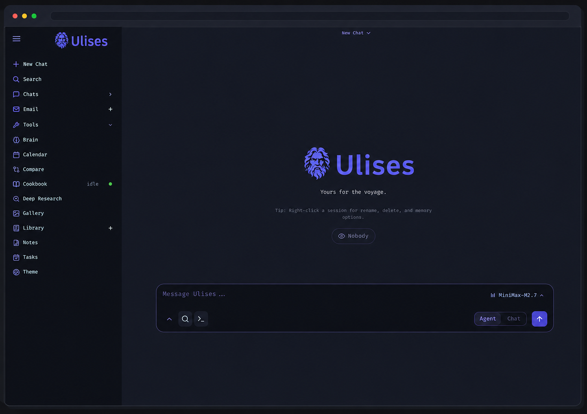

<p align="center">
  
</p>

<p align="center">
  Un espacio de trabajo de IA auto-alojado para chat, agentes, investigación, documentos, correo electrónico, notas, calendario y flujos de trabajo con modelos locales.
</p>

<p align="center">
  <a href="#inicio-rapido">Inicio Rápido</a> ·
  <a href="docs/setup.md">Guía de Instalación</a> ·
  <a href="CONTRIBUTING.md">Contribuir</a> ·
  <a href="ROADMAP.md">Hoja de Ruta</a>
</p>

<p align="center">
  <a href="https://repology.org/project/ulises-ai/versions"></a>
</p>

<p align="center">
  
</p>

---

## Inicio Rápido

> `dev` es la rama por defecto y recibe los cambios más recientes primero. Usa [`main`](https://github.com/ChicoCifrado/ulises/tree/main) si prefieres una rama más estable.

```bash
git clone https://github.com/ChicoCifrado/ulises.git
cd ulises
cp .env.example .env
docker compose up -d --build
```

Abre `http://localhost:7000` cuando los contenedores estén saludables. La primera contraseña de administrador se muestra en `docker compose logs ulises`.

Las instalaciones nativas, notas sobre GPU, instrucciones para Windows/macOS, HTTPS y configuración están en la [guía de instalación](docs/setup.md).

## Funcionalidades

- **Chat + Agentes** — modelos locales/API, herramientas, MCP, archivos, shell, habilidades y memoria.
- **Cookbook** — recomendaciones de modelos según hardware, descargas y servido.
- **Investigación Profunda** — investigación web multi-paso con lectura de fuentes y generación de informes.
- **Comparar** — pruebas ciegas lado a lado de modelos y síntesis.
- **Documentos** — editor orientado a la escritura con ediciones por IA, sugerencias, Markdown, HTML, CSV y resaltado de sintaxis.
- **Correo Electrónico** — bandeja de entrada IMAP/SMTP con clasificación, etiquetas, resúmenes, recordatorios y borradores de respuesta.
- **Notas, Tareas + Calendario** — recordatorios, tareas pendientes, tareas programadas de agentes y sincronización CalDAV.
- **Extras** — galería/editor de imágenes, temas, subidas, búsqueda web, preajustes, sesiones y 2FA.

## Demo

Un tour interactivo completo está disponible en la página de inicio: [`docs/index.html`](docs/index.html).

## Contribuir

La ayuda es bienvenida. Los mejores puntos de entrada son: probar instalaciones desde cero, errores de configuración de proveedores, mejoras en la interfaz móvil/editor, documentación y refactorizaciones pequeñas y enfocadas. Consulta [CONTRIBUTING.md](CONTRIBUTING.md) y [ROADMAP.md](ROADMAP.md).

## Seguridad

Ulises es un espacio de trabajo auto-alojado con potentes herramientas locales. Mantén la autenticación activada, no incluyas datos privados en Git y no expongas puertos de modelos/servicios directamente al público. Los detalles de despliegue están en la [guía de instalación](docs/setup.md#security-notes).

## Historial de Estrellas

<a href="https://www.star-history.com/?repos=ChicoCifrado%2Fulises&type=date&legend=top-left">
 <picture>
   <source media="(prefers-color-scheme: dark)" srcset="https://api.star-history.com/chart?repos=ChicoCifrado/ulises&type=date&theme=dark&legend=top-left" />
   <source media="(prefers-color-scheme: light)" srcset="https://api.star-history.com/chart?repos=ChicoCifrado/ulises&type=date&legend=top-left" />
   
 </picture>
</a>

## Licencia

AGPL-3.0-or-later — consulta [LICENSE](LICENSE) y [ACKNOWLEDGMENTS.md](ACKNOWLEDGMENTS.md).
